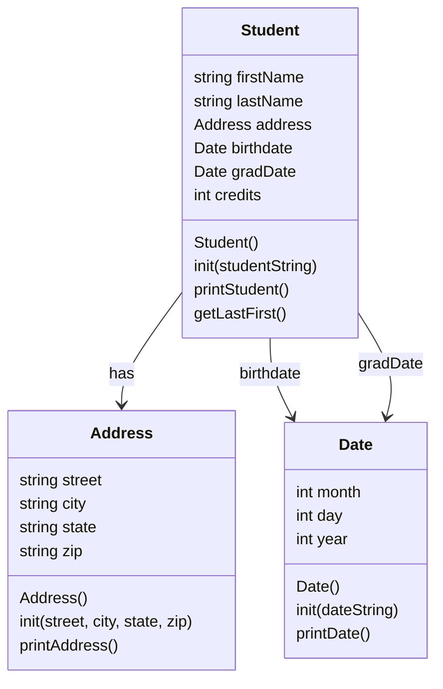

# Heap-of-Students-Part-1


```
-Algorithm/Psuedocode-

Run program.
Create the main student class.
Create the date helper class (which will store the month, day, and year)
Create the address helper class to store the street, city, state, and zip.
The student class will hold:
    -The first name
    -The last name
    -An address (object)
    -A birthdate (date)
    -A gradDate (date)
    -Credit hours
Test the address and date using the test functions.
(Week 2) Prep and load the CSV file which will contain the student data.
(Week 2) For each line in the CSV file:
    -Create a Student object.
    -Call the Student.init() to parse the CSV contents.
    -Store the Student object in a collection.
(Week 2) Print/process the students somehow.
(Week 2) End the program. 

---Class Algorithms n' stuff---

Address.init()
    Intake street, city. state and zip code as strings.
    Put each string into it's own data pool. 
    
Address.printAdress()
    Print the street on its own line.
    Print the city, state, and zip on the next line so it looks neat. 

Date.init(dateString)
    Recieve a date.
    Convert that date to a string.
    Parse each value (month, day, year)
    Retrieve the month.
    Retrieve the day.
    Retrieve the year.
    Turn those values into integers.
    Store those integers in month, day, year. 

Date.printDate()
    Convert the numeric month into its month name. 1-12?
    Print month name and year.    
