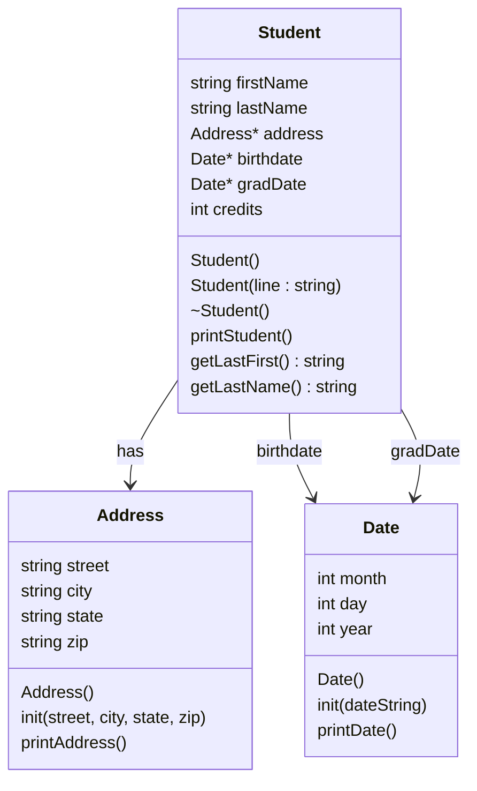

# Heap-of-Students-Part-1


```mermaid
classDiagram
    class Address {
        string street
        string city
        string state
        string zip
        Address()
        init(street, city, state, zip)
        printAddress()
    }
    class Date {
        int month
        int day
        int year
        Date()
        init(dateString)
        printDate()
    }
    class Student {
        string firstName
        string lastName
        Address* address
        Date* birthdate
        Date* gradDate
        int credits
        Student()
        Student(line : string)
        ~Student()
        printStudent()
        getLastFirst() string
        getLastName() string
    }
    %% Relationships
    Student --> Address : has
    Student --> Date : birthdate
    Student --> Date : gradDate
```
```
-Algorithm/Psuedocode-

Run program.
Create the main student class.
Create the date helper class (which will store the month, day, and year)
Create the address helper class to store the street, city, state, and zip.
The student class will hold:
    -The first name
    -The last name
    -An address (object)
    -A birthdate (date)
    -A gradDate (date)
    -Credit hours
Test the address and date using the test functions.
(Week 2) Prep and load the CSV file which will contain the student data.
(Week 2) For each line in the CSV file:
    -Create a Student object.
    -Call the Student.init() to parse the CSV contents.
    -Store the Student object in a collection.
(Week 2) Print/process the students somehow.
(Week 2) End the program. 

---Class Algorithms n' stuff---

Address.init()
    Intake street, city. state and zip code as strings.
    Put each string into it's own data pool. 
    
Address.printAdress()
    Print the street on its own line.
    Print the city, state, and zip on the next line so it looks neat. 

Date.init(dateString)
    Recieve a date.
    Convert that date to a string.
    Parse each value (month, day, year)
    Retrieve the month.
    Retrieve the day.
    Retrieve the year.
    Turn those values into integers.
    Store those integers in month, day, year. 

Date.printDate()
    Convert the numeric month into its month name. 1-12?
    Print month name and year.
--------------------------------
-------------Part 2------------- 
loadStudents(students)
    Open the student CSV file.
    While there are lines left in the file:
        Read a line from the file. 
        Create a new student object using the CSV constructor.
        Add the student pointer to the students vector.
    Close the CSV file.

printStudents(students)
    For every student in the student vector:
        Call printStudent()

showStudentNames(students)
    For every student on the student vector:
        Retrieve the student's last and first name using getLastFirst().
        Print the retrieved last and first name.

findStudent(students)
    Ask the user to enter the name of whichever student they're searching for.
    Process user input?
    For each student inside the student vector:
        If the student's last name matches the user's search input:
            Print the student's full info using printStudent()
        If there were no matches the user's search:
            Print a message saying "No such student."

delStudents(students)
    For each student pointer in the student vector:
        Delete the student pointer to free up some space.
    Clear the student vector so it's empty.

menu()
    Print the menu options, which will be:
        0) Quit
        1) Print all student names
        2) Print all student data
        3) Find a student
    Return user choice.
    Return the requested information (or quit, if selected)

Main Loop (Part 2)
    Make an empty vector of student pointers.
    Call loadStudents() to fill that vector.
    Loop through the menu() to retrieve the user's choice.
        If the choice is "1":
            Call showStudentNames()
        If the choice is "2":
            Call printStudents()
        If the choice is "3":
            Call findStudent()
    Until the user enters "0"
    Finally, call delStudents() to free up all the memory.
    End the program.
